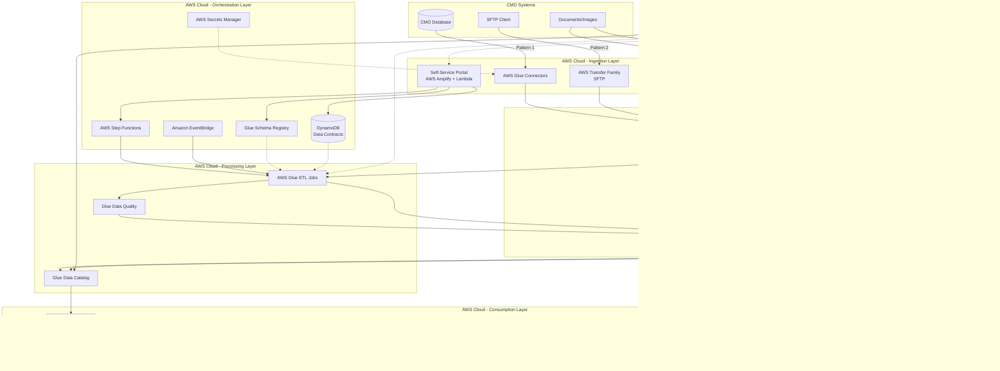

# Design Document: Pharma Data Exchange Hub

## Overview

The Pharma Data Exchange Hub is a cloud-native, self-service data integration platform built on AWS that enables Contract Manufacturing Organizations (CMOs) to onboard and share pharmaceutical manufacturing data with Merck in 1-4 weeks instead of 3-6 months. The platform provides three flexible integration patterns, automated pipeline deployment, AI-powered document processing, and comprehensive data governance to ensure GxP compliance and 21 CFR Part 11 regulatory requirements.

### Design Goals

1. **Self-Service**: Enable CMOs to onboard independently without Merck IT involvement
2. **Flexibility**: Support 100% of CMOs through three integration patterns (native connectors, file transfer, AI extraction)
3. **Automation**: Deploy data pipelines automatically from data contracts
4. **Quality**: Validate all data against schemas and quality rules before consumption
5. **Compliance**: Maintain complete audit trails for FDA inspections
6. **Scalability**: Handle multiple CMOs with isolated data and access controls
7. **Intelligence**: Enable natural language queries across all CMO data

### Key Constraints

- Must comply with 21 CFR Part 11 (electronic records and signatures)
- Must support GxP-qualified AWS services only
- Must provide row-level and column-level access control
- Must encrypt all data at rest and in transit
- Must retain audit logs for 7 years minimum
- Must support schema evolution without breaking existing pipelines
- Must handle both structured and unstructured data formats

## Architecture

The platform follows a microservices architecture with event-driven orchestration and a medallion data lake pattern.


### High-Level Architecture Diagram



### Architecture Layers

1. **Ingestion Layer**: Three integration patterns for data entry
2. **Orchestration Layer**: Workflow management and metadata storage
3. **Data Lake**: Medallion architecture (Bronze/Silver/Gold)
4. **Processing Layer**: ETL transformations and quality validation
5. **Governance Layer**: Security, access control, and compliance
6. **Consumption Layer**: Analytics, BI, and AI-powered queries


## Components and Interfaces

### 1. Self-Service Portal (Frontend)

**Technology**: React with AWS Cloudscape Design System, hosted on AWS Amplify

**Responsibilities**:
- CMO registration and authentication
- Data contract creation and management
- Schema definition and inference
- Integration pattern selection
- Pipeline activation and monitoring
- Dashboard visualization

**Key Interfaces**:
```typescript
interface CMOProfile {
  cmoId: string;              // Format: cmo-{name}
  organizationName: string;
  contactEmail: string;
  contactPhone: string;
  address: string;
  gxpCertified: boolean;
  createdAt: Date;
  status: 'active' | 'inactive' | 'suspended';
}

interface DataContract {
  contractId: string;         // Format: CMO-{NAME}-{DOMAIN}-{NUMBER}
  cmoId: string;
  dataDomain: string;         // e.g., 'batch-records', 'quality-data'
  schemaId: string;
  schemaVersion: string;
  qualityRules: QualityRule[];
  sla: SLA;
  deliverySchedule: DeliverySchedule;
  governance: Governance;
  status: 'draft' | 'active' | 'suspended';
  createdAt: Date;
  updatedAt: Date;
}

interface QualityRule {
  ruleId: string;
  ruleName: string;
  ruleType: 'completeness' | 'accuracy' | 'uniqueness' | 'consistency';
  expression: string;         // Glue Data Quality DQDL expression
  threshold: number;          // 0-100 percentage
  severity: 'warning' | 'error';
}

interface SLA {
  timeliness: {
    maxDelayHours: number;
    measurementWindow: string;
  };
  availability: {
    uptimePercentage: number;
    measurementWindow: string;
  };
  quality: {
    minQualityScore: number;
    measurementWindow: string;
  };
}

interface DeliverySchedule {
  frequency: 'real-time' | 'hourly' | 'daily' | 'weekly' | 'monthly';
  cronExpression?: string;
  timezone: string;
}

interface Governance {
  dataClassification: 'public' | 'internal' | 'confidential' | 'restricted';
  retentionYears: number;
  allowedUsers: string[];
  allowedGroups: string[];
  piiFields: string[];
  encryptionRequired: boolean;
}
```

**API Endpoints** (AWS API Gateway + Lambda):
- `POST /api/cmo/register` - Register new CMO
- `GET /api/cmo/{cmoId}` - Get CMO profile
- `POST /api/contract` - Create data contract
- `PUT /api/contract/{contractId}` - Update data contract
- `POST /api/contract/{contractId}/activate` - Activate pipeline
- `GET /api/contract/{contractId}/status` - Get pipeline status
- `POST /api/schema/infer` - Infer schema from sample data
- `GET /api/schema/{schemaId}` - Get schema definition


### 2. Schema Registry Service

**Technology**: AWS Glue Schema Registry with Lambda wrapper

**Responsibilities**:
- Register and version schemas (AVRO/JSON Schema)
- Validate schema compatibility
- Provide schema evolution rules
- Serve schemas to ETL jobs

**Key Operations**:
```python
class SchemaRegistryService:
    def register_schema(self, schema_name: str, schema_definition: dict, 
                       data_format: str) -> str:
        """
        Register a new schema or version.
        Returns: schema_version_id
        """
        pass
    
    def validate_compatibility(self, schema_name: str, 
                              new_schema: dict) -> bool:
        """
        Check if new schema is backward compatible.
        """
        pass
    
    def get_schema(self, schema_id: str, version: str = 'latest') -> dict:
        """
        Retrieve schema definition by ID and version.
        """
        pass
    
    def infer_schema_from_sample(self, sample_data: list) -> dict:
        """
        Analyze sample data and generate schema.
        Supports CSV, JSON, Parquet formats.
        """
        pass
```

**Schema Format** (AVRO):
```json
{
  "type": "record",
  "name": "BatchRecord",
  "namespace": "com.merck.cmo.alpha",
  "fields": [
    {"name": "batch_id", "type": "string"},
    {"name": "product_name", "type": "string"},
    {"name": "manufacture_date", "type": {"type": "long", "logicalType": "timestamp-millis"}},
    {"name": "quantity", "type": "double"},
    {"name": "unit", "type": "string"},
    {"name": "quality_status", "type": {"type": "enum", "symbols": ["PASS", "FAIL", "PENDING"]}}
  ]
}
```


### 3. Pipeline Orchestration Service

**Technology**: AWS Step Functions with Lambda tasks

**Responsibilities**:
- Deploy data pipelines from contracts
- Configure integration pattern resources
- Create and schedule Glue ETL jobs
- Handle deployment failures and rollbacks

**Step Functions Workflow**:
```json
{
  "Comment": "Deploy CMO Data Pipeline",
  "StartAt": "ValidateContract",
  "States": {
    "ValidateContract": {
      "Type": "Task",
      "Resource": "arn:aws:lambda:validate-contract",
      "Next": "DeterminePattern"
    },
    "DeterminePattern": {
      "Type": "Choice",
      "Choices": [
        {
          "Variable": "$.integrationPattern",
          "StringEquals": "native-connector",
          "Next": "ConfigureGlueConnector"
        },
        {
          "Variable": "$.integrationPattern",
          "StringEquals": "secure-transfer",
          "Next": "ProvisionSFTP"
        },
        {
          "Variable": "$.integrationPattern",
          "StringEquals": "ai-unstructured",
          "Next": "ConfigureAIProcessing"
        }
      ]
    },
    "ConfigureGlueConnector": {
      "Type": "Task",
      "Resource": "arn:aws:lambda:configure-glue-connector",
      "Next": "CreateETLJob"
    },
    "ProvisionSFTP": {
      "Type": "Task",
      "Resource": "arn:aws:lambda:provision-sftp",
      "Next": "CreateETLJob"
    },
    "ConfigureAIProcessing": {
      "Type": "Task",
      "Resource": "arn:aws:lambda:configure-ai-processing",
      "Next": "CreateETLJob"
    },
    "CreateETLJob": {
      "Type": "Task",
      "Resource": "arn:aws:lambda:create-etl-job",
      "Next": "RegisterInCatalog"
    },
    "RegisterInCatalog": {
      "Type": "Task",
      "Resource": "arn:aws:lambda:register-catalog",
      "Next": "SetupMonitoring"
    },
    "SetupMonitoring": {
      "Type": "Task",
      "Resource": "arn:aws:lambda:setup-monitoring",
      "Next": "NotifySuccess"
    },
    "NotifySuccess": {
      "Type": "Task",
      "Resource": "arn:aws:lambda:notify-success",
      "End": true
    }
  }
}
```


### 4. Data Ingestion Services

#### Pattern 1: Native Connector Service

**Technology**: AWS Glue JDBC/Native Connectors

**Supported Platforms**:
- Snowflake (native connector)
- Oracle (JDBC)
- SQL Server (JDBC)
- PostgreSQL (JDBC)
- SAP HANA (JDBC)
- Databricks (native connector)

**Configuration**:
```python
class NativeConnectorConfig:
    connection_type: str        # 'snowflake', 'oracle', 'sqlserver', etc.
    connection_url: str         # JDBC URL or native connection string
    username: str               # Stored in Secrets Manager
    password: str               # Stored in Secrets Manager
    database: str
    schema: str
    table_or_query: str         # Table name or SQL query
    partition_column: str       # For parallel extraction
    num_partitions: int         # Parallelism level
```

#### Pattern 2: Secure Transfer Service

**Technology**: AWS Transfer Family (SFTP)

**Configuration**:
```python
class SecureTransferConfig:
    sftp_endpoint: str          # Auto-generated hostname
    username: str               # CMO-specific username
    password: str               # Generated and stored in Secrets Manager
    home_directory: str         # S3 path: /bronze/{cmo-id}/incoming/
    allowed_file_patterns: list # ['*.csv', '*.parquet', '*.json']
    max_file_size_mb: int       # File size limit
```

**File Processing Flow**:
1. CMO uploads file to SFTP endpoint
2. S3 event notification triggers Lambda
3. Lambda validates file format and size
4. Lambda moves file to Bronze layer with partitioning
5. EventBridge triggers ETL job for processing

#### Pattern 3: AI Unstructured Service

**Technology**: Amazon Textract + Amazon Rekognition + Lambda

**Document Processing Pipeline**:
```python
class AIProcessingConfig:
    document_types: list        # ['pdf', 'png', 'jpg', 'tiff']
    extraction_features: list   # ['TABLES', 'FORMS', 'QUERIES']
    confidence_threshold: float # Minimum confidence (0.0-1.0)
    manual_review_threshold: float  # Below this, flag for review
    output_format: str          # 'json'
```

**Processing Steps**:
1. Document uploaded to S3 incoming bucket
2. Lambda determines document type (PDF vs image)
3. Textract extracts text, tables, forms
4. Lambda parses extraction into schema-compliant JSON
5. If confidence < threshold, flag for manual review
6. Write structured JSON to Bronze layer


### 5. ETL Processing Service

**Technology**: AWS Glue ETL (PySpark)

**Responsibilities**:
- Extract data from Bronze layer
- Validate against schema and quality rules
- Transform and cleanse data
- Write to Silver and Gold layers
- Update Glue Data Catalog

**ETL Job Structure**:
```python
class ETLJob:
    def __init__(self, contract: DataContract, glue_context: GlueContext):
        self.contract = contract
        self.glue_context = glue_context
        self.schema = self.load_schema()
        self.quality_rules = self.load_quality_rules()
    
    def extract_from_bronze(self) -> DynamicFrame:
        """Read raw data from Bronze layer."""
        path = f"s3://data-lake/bronze/{self.contract.cmoId}/{self.contract.dataDomain}/"
        return self.glue_context.create_dynamic_frame.from_options(
            connection_type="s3",
            connection_options={"paths": [path]},
            format="parquet"
        )
    
    def validate_schema(self, df: DynamicFrame) -> DynamicFrame:
        """Validate data against registered schema."""
        # Apply schema from Schema Registry
        # Drop or quarantine records that don't match
        pass
    
    def apply_quality_rules(self, df: DynamicFrame) -> tuple[DynamicFrame, dict]:
        """
        Run Glue Data Quality rules.
        Returns: (validated_df, quality_metrics)
        """
        ruleset = self.build_dqdl_ruleset()
        result = evaluate_data_quality(
            frame=df,
            ruleset=ruleset,
            publishing_options={
                "cloudwatch_metrics_enabled": True,
                "results_s3_prefix": f"s3://quality-results/{self.contract.contractId}/"
            }
        )
        return result.validated_frame, result.metrics
    
    def transform_to_silver(self, df: DynamicFrame) -> DynamicFrame:
        """Apply transformations and write to Silver layer."""
        # Data type conversions
        # Null handling
        # Deduplication
        # Standardization
        pass
    
    def aggregate_to_gold(self, df: DynamicFrame) -> DynamicFrame:
        """Create business-ready aggregations for Gold layer."""
        # Aggregations by time period
        # Calculated metrics
        # Denormalization for query performance
        pass
    
    def write_to_layer(self, df: DynamicFrame, layer: str):
        """Write data to specified layer with partitioning."""
        path = f"s3://data-lake/{layer}/{self.contract.cmoId}/{self.contract.dataDomain}/"
        df.write.mode("append").partitionBy("year", "month", "day").parquet(path)
    
    def update_catalog(self, layer: str):
        """Register or update table in Glue Data Catalog."""
        pass
```

**Data Quality Rules (DQDL)**:
```python
# Example Glue Data Quality Definition Language rules
QUALITY_RULESET = """
Rules = [
    ColumnExists "batch_id",
    ColumnExists "manufacture_date",
    ColumnValues "batch_id" matches "[A-Z0-9]{10}",
    Completeness "batch_id" > 0.99,
    Uniqueness "batch_id" > 0.99,
    ColumnValues "quality_status" in ["PASS", "FAIL", "PENDING"],
    RowCount between 1 and 1000000,
    CustomSql "SELECT COUNT(*) FROM primary WHERE manufacture_date > CURRENT_DATE - INTERVAL '30' DAY" > 0
]
"""
```


### 6. Access Control Service

**Technology**: AWS Lake Formation + IAM Identity Center

**Responsibilities**:
- Enforce row-level and column-level security
- Manage CMO data isolation
- Integrate with corporate SSO
- Audit all data access

**Access Control Model**:
```python
class AccessPolicy:
    principal: str              # User or group ARN
    resource: str               # Database.table
    permissions: list           # ['SELECT', 'DESCRIBE']
    row_filter: str             # SQL WHERE clause
    column_filter: list         # Allowed column names
    data_classification: str    # 'confidential', 'restricted'
    
class LakeFormationService:
    def grant_access(self, policy: AccessPolicy):
        """Grant fine-grained access to data."""
        lakeformation.grant_permissions(
            Principal={'DataLakePrincipalIdentifier': policy.principal},
            Resource={
                'Table': {
                    'DatabaseName': policy.resource.split('.')[0],
                    'Name': policy.resource.split('.')[1]
                }
            },
            Permissions=policy.permissions,
            PermissionsWithGrantOption=[],
            DataCellsFilter={
                'RowFilter': {'FilterExpression': policy.row_filter},
                'ColumnNames': policy.column_filter
            }
        )
    
    def enforce_cmo_isolation(self, user_id: str, cmo_id: str):
        """
        Ensure users can only access data from authorized CMOs.
        Implemented via row filter: WHERE cmo_id = '{cmo_id}'
        """
        pass
```

**PII Detection and Masking**:
```python
class PIIService:
    def scan_for_pii(self, s3_path: str) -> list:
        """Use Amazon Macie to detect PII fields."""
        macie.create_classification_job(
            s3_bucket_definitions=[{'accountId': ACCOUNT_ID, 'buckets': [s3_path]}]
        )
        # Returns list of PII field names
        pass
    
    def apply_masking(self, df: DynamicFrame, pii_fields: list) -> DynamicFrame:
        """Mask PII fields based on data classification."""
        for field in pii_fields:
            df = df.withColumn(field, sha2(col(field), 256))
        return df
```


### 7. Monitoring and Alerting Service

**Technology**: Amazon CloudWatch + Amazon SNS

**Responsibilities**:
- Track pipeline execution metrics
- Monitor SLA compliance
- Send alerts for failures and threshold breaches
- Provide operational dashboards

**Metrics Collection**:
```python
class MonitoringService:
    def record_pipeline_metrics(self, contract_id: str, metrics: dict):
        """Publish custom metrics to CloudWatch."""
        cloudwatch.put_metric_data(
            Namespace='CMO/DataPipeline',
            MetricData=[
                {
                    'MetricName': 'ExecutionTime',
                    'Value': metrics['execution_time_seconds'],
                    'Unit': 'Seconds',
                    'Dimensions': [
                        {'Name': 'ContractId', 'Value': contract_id},
                        {'Name': 'CMOId', 'Value': metrics['cmo_id']}
                    ]
                },
                {
                    'MetricName': 'RecordsProcessed',
                    'Value': metrics['record_count'],
                    'Unit': 'Count',
                    'Dimensions': [
                        {'Name': 'ContractId', 'Value': contract_id}
                    ]
                },
                {
                    'MetricName': 'QualityScore',
                    'Value': metrics['quality_score'],
                    'Unit': 'Percent',
                    'Dimensions': [
                        {'Name': 'ContractId', 'Value': contract_id}
                    ]
                }
            ]
        )
    
    def check_sla_compliance(self, contract: DataContract, metrics: dict) -> bool:
        """Compare metrics against SLA thresholds."""
        timeliness_ok = metrics['delay_hours'] <= contract.sla.timeliness.maxDelayHours
        quality_ok = metrics['quality_score'] >= contract.sla.quality.minQualityScore
        return timeliness_ok and quality_ok
    
    def send_alert(self, severity: str, message: str, contract_id: str):
        """Send SNS notification for alerts."""
        sns.publish(
            TopicArn=f'arn:aws:sns:us-east-1:account:cmo-alerts-{severity}',
            Subject=f'[{severity.upper()}] CMO Pipeline Alert',
            Message=message,
            MessageAttributes={
                'ContractId': {'DataType': 'String', 'StringValue': contract_id},
                'Severity': {'DataType': 'String', 'StringValue': severity}
            }
        )
```

**CloudWatch Alarms**:
- Pipeline execution failures (3 consecutive failures)
- SLA timeliness breach (delay > threshold)
- Quality score below threshold
- High error rate (> 5% of records)
- SFTP authentication failures
- Schema validation failures


### 8. Natural Language Query Service

**Technology**: Amazon Bedrock (Claude 3) + Amazon Athena

**Responsibilities**:
- Convert natural language to SQL
- Execute queries with access control
- Format results in natural language
- Handle multi-CMO queries

**Query Processing Flow**:
```python
class NLQueryService:
    def __init__(self):
        self.bedrock = boto3.client('bedrock-runtime')
        self.athena = boto3.client('athena')
        self.catalog = GlueDataCatalog()
    
    def process_query(self, user_query: str, user_id: str) -> str:
        """
        Process natural language query and return response.
        """
        # 1. Get user's accessible tables from Lake Formation
        accessible_tables = self.get_user_tables(user_id)
        
        # 2. Get table schemas from Glue Data Catalog
        schema_context = self.build_schema_context(accessible_tables)
        
        # 3. Generate SQL using Bedrock
        sql_query = self.generate_sql(user_query, schema_context)
        
        # 4. Execute query with Athena (enforces Lake Formation permissions)
        results = self.execute_athena_query(sql_query, user_id)
        
        # 5. Format results as natural language
        response = self.format_response(user_query, results)
        
        return response
    
    def generate_sql(self, user_query: str, schema_context: str) -> str:
        """Use Bedrock to convert natural language to SQL."""
        prompt = f"""
        You are a SQL expert. Convert the following natural language query to SQL.
        
        Available tables and schemas:
        {schema_context}
        
        User query: {user_query}
        
        Generate a valid SQL query that answers the user's question.
        Only use tables and columns from the schema provided.
        """
        
        response = self.bedrock.invoke_model(
            modelId='anthropic.claude-3-sonnet-20240229-v1:0',
            body=json.dumps({
                'anthropic_version': 'bedrock-2023-05-31',
                'messages': [{'role': 'user', 'content': prompt}],
                'max_tokens': 1000
            })
        )
        
        # Extract SQL from response
        sql = self.extract_sql_from_response(response)
        return sql
    
    def execute_athena_query(self, sql: str, user_id: str) -> list:
        """Execute SQL with Athena, enforcing Lake Formation permissions."""
        response = self.athena.start_query_execution(
            QueryString=sql,
            QueryExecutionContext={'Database': 'cmo_data_lake'},
            ResultConfiguration={'OutputLocation': 's3://athena-results/'},
            WorkGroup='cmo-workgroup'  # Configured with Lake Formation integration
        )
        
        # Wait for completion and get results
        results = self.athena.get_query_results(
            QueryExecutionId=response['QueryExecutionId']
        )
        
        return self.parse_athena_results(results)
    
    def format_response(self, original_query: str, results: list) -> str:
        """Format query results as natural language."""
        prompt = f"""
        The user asked: {original_query}
        
        Query results:
        {json.dumps(results, indent=2)}
        
        Provide a clear, concise natural language answer to the user's question
        based on these results.
        """
        
        response = self.bedrock.invoke_model(
            modelId='anthropic.claude-3-sonnet-20240229-v1:0',
            body=json.dumps({
                'anthropic_version': 'bedrock-2023-05-31',
                'messages': [{'role': 'user', 'content': prompt}],
                'max_tokens': 500
            })
        )
        
        return self.extract_text_from_response(response)
```


## Data Models

### DynamoDB Tables

#### CMO Profiles Table
```python
{
    "TableName": "cmo-profiles",
    "KeySchema": [
        {"AttributeName": "cmoId", "KeyType": "HASH"}
    ],
    "AttributeDefinitions": [
        {"AttributeName": "cmoId", "AttributeType": "S"},
        {"AttributeName": "organizationName", "AttributeType": "S"}
    ],
    "GlobalSecondaryIndexes": [
        {
            "IndexName": "organization-name-index",
            "KeySchema": [{"AttributeName": "organizationName", "KeyType": "HASH"}],
            "Projection": {"ProjectionType": "ALL"}
        }
    ]
}
```

#### Data Contracts Table
```python
{
    "TableName": "data-contracts",
    "KeySchema": [
        {"AttributeName": "contractId", "KeyType": "HASH"}
    ],
    "AttributeDefinitions": [
        {"AttributeName": "contractId", "AttributeType": "S"},
        {"AttributeName": "cmoId", "AttributeType": "S"},
        {"AttributeName": "status", "AttributeType": "S"}
    ],
    "GlobalSecondaryIndexes": [
        {
            "IndexName": "cmo-contracts-index",
            "KeySchema": [
                {"AttributeName": "cmoId", "KeyType": "HASH"},
                {"AttributeName": "status", "KeyType": "RANGE"}
            ],
            "Projection": {"ProjectionType": "ALL"}
        }
    ]
}
```

#### Pipeline Execution History Table
```python
{
    "TableName": "pipeline-executions",
    "KeySchema": [
        {"AttributeName": "contractId", "KeyType": "HASH"},
        {"AttributeName": "executionTimestamp", "KeyType": "RANGE"}
    ],
    "AttributeDefinitions": [
        {"AttributeName": "contractId", "AttributeType": "S"},
        {"AttributeName": "executionTimestamp", "AttributeType": "N"}
    ],
    "TimeToLiveSpecification": {
        "Enabled": true,
        "AttributeName": "ttl"  # Auto-delete after 90 days
    }
}
```

### S3 Data Lake Structure

```
s3://cmo-data-lake/
├── bronze/                          # Raw ingested data
│   ├── cmo-alpha/
│   │   ├── batch-records/
│   │   │   ├── year=2024/
│   │   │   │   ├── month=01/
│   │   │   │   │   ├── day=15/
│   │   │   │   │   │   └── data.parquet
│   │   ├── quality-data/
│   ├── cmo-beta/
│   └── quarantine/                  # Failed validation records
│       └── {contract-id}/
│           └── {timestamp}/
├── silver/                          # Validated and cleansed data
│   ├── cmo-alpha/
│   │   ├── batch-records/
│   │   │   └── year=2024/month=01/day=15/
│   ├── cmo-beta/
├── gold/                            # Business-ready aggregated data
│   ├── batch-summary-daily/
│   ├── quality-metrics-monthly/
│   └── cmo-performance-dashboard/
└── quality-results/                 # Data quality check results
    └── {contract-id}/
        └── {execution-id}/
```

### Glue Data Catalog Schema

```python
# Example table definition in Glue Data Catalog
{
    "DatabaseName": "cmo_data_lake",
    "TableInput": {
        "Name": "cmo_alpha_batch_records_silver",
        "StorageDescriptor": {
            "Columns": [
                {"Name": "batch_id", "Type": "string"},
                {"Name": "product_name", "Type": "string"},
                {"Name": "manufacture_date", "Type": "timestamp"},
                {"Name": "quantity", "Type": "double"},
                {"Name": "unit", "Type": "string"},
                {"Name": "quality_status", "Type": "string"},
                {"Name": "ingestion_timestamp", "Type": "timestamp"},
                {"Name": "validation_status", "Type": "string"}
            ],
            "Location": "s3://cmo-data-lake/silver/cmo-alpha/batch-records/",
            "InputFormat": "org.apache.hadoop.hive.ql.io.parquet.MapredParquetInputFormat",
            "OutputFormat": "org.apache.hadoop.hive.ql.io.parquet.MapredParquetOutputFormat",
            "SerdeInfo": {
                "SerializationLibrary": "org.apache.hadoop.hive.ql.io.parquet.serde.ParquetHiveSerDe"
            }
        },
        "PartitionKeys": [
            {"Name": "year", "Type": "string"},
            {"Name": "month", "Type": "string"},
            {"Name": "day", "Type": "string"}
        ],
        "TableType": "EXTERNAL_TABLE"
    }
}
```


## Correctness Properties

A property is a characteristic or behavior that should hold true across all valid executions of a system—essentially, a formal statement about what the system should do. Properties serve as the bridge between human-readable specifications and machine-verifiable correctness guarantees.

### Property 1: CMO Registration Validation
*For any* CMO registration submission with required fields, the system should validate all fields and create a CMO profile with a unique ID in the format `cmo-{name}`.
**Validates: Requirements 1.2**

### Property 2: Unique Credential Generation
*For any* CMO profile creation or SFTP provisioning, the system should generate unique credentials that do not collide with existing credentials and store them securely in AWS Secrets Manager.
**Validates: Requirements 1.3, 6.2**

### Property 3: Pattern-Specific Configuration Display
*For any* integration pattern selection (Pattern 1, 2, or 3), the system should display the correct pattern-specific configuration options in the UI.
**Validates: Requirements 1.4**

### Property 4: Data Contract Component Capture
*For any* data contract definition, the system should capture and store all required components: schema definition, quality rules, SLAs, delivery schedule, and governance requirements.
**Validates: Requirements 2.1**

### Property 5: Schema Format Validation
*For any* schema submission, the system should validate that the schema conforms to either AVRO or JSON Schema format and reject invalid schemas.
**Validates: Requirements 2.2**

### Property 6: Schema Registration with Versioning
*For any* valid schema submission, the Schema Registry should register the schema with a version number and return a unique schema ID.
**Validates: Requirements 2.3, 3.3**

### Property 7: Contract ID Format Compliance
*For any* data contract saved to DynamoDB, the contract ID should follow the format `CMO-{NAME}-{DOMAIN}-{NUMBER}` where NAME is uppercase, DOMAIN is the data domain, and NUMBER is a sequential integer.
**Validates: Requirements 2.4**

### Property 8: Quality Rule Executability
*For any* quality rule definition, the system should validate that the rule can be expressed as valid Glue Data Quality DQDL syntax before accepting it.
**Validates: Requirements 2.5**

### Property 9: SLA Threshold Measurability
*For any* SLA specification, the system should validate that timeliness and availability thresholds are numeric values within valid ranges (0-100 for percentages, positive numbers for time).
**Validates: Requirements 2.6**

### Property 10: Schema Compatibility Checking
*For any* schema update to an existing contract, the Schema Registry should validate backward compatibility with the previous version and reject incompatible changes.
**Validates: Requirements 2.7**

### Property 11: Schema Inference from Sample Data
*For any* sample data file upload (CSV, JSON, Parquet), the system should analyze the file and infer a schema containing field names, types, and basic constraints.
**Validates: Requirements 3.1**

### Property 12: Schema Merging from Multiple Files
*For any* set of multiple sample files for the same data domain, the system should merge the inferred schemas and identify common fields across all files.
**Validates: Requirements 3.5**

### Property 13: Pipeline Deployment Workflow Triggering
*For any* data contract activation, the system should trigger a Step Functions workflow with the contract details and integration pattern configuration.
**Validates: Requirements 4.1**

### Property 14: S3 Path Pattern Compliance
*For any* Glue ETL job creation, the system should configure S3 paths following the pattern `s3://bucket/{layer}/{cmo-id}/{data-domain}/` where layer is bronze/silver/gold.
**Validates: Requirements 4.6**

### Property 15: Connection Type Support
*For any* Pattern 1 configuration, the system should support all specified connection types: Snowflake, Oracle, SQL Server, PostgreSQL, SAP, and Databricks.
**Validates: Requirements 5.1**

### Property 16: Connectivity Testing Before Activation
*For any* connection credential submission, the system should test connectivity to the data source before activating the pipeline and report success or failure.
**Validates: Requirements 5.2**

### Property 17: Data Writing to Bronze Layer
*For any* data ingestion (Pattern 1, 2, or 3), the system should write raw data to the Bronze layer in Parquet format with Snappy compression and date partitioning (year/month/day).
**Validates: Requirements 5.4, 6.5, 7.6, 9.1, 9.2, 9.6**

### Property 18: File Format Validation Against Schema
*For any* file uploaded via SFTP (Pattern 2), the system should validate the file format against the data contract schema and reject files that don't match.
**Validates: Requirements 6.4**

### Property 19: AI Extraction Confidence Thresholding
*For any* AI-extracted data (Textract or Rekognition), if the extraction confidence is below 85%, the system should flag the record for manual review and not promote it to Silver layer.
**Validates: Requirements 7.5**

### Property 20: Comprehensive Data Quality Validation
*For any* data arriving in Bronze layer, the system should trigger Glue Data Quality validation that checks all rule types from the contract: completeness, accuracy, uniqueness, and consistency.
**Validates: Requirements 8.1, 8.2**

### Property 21: Validation Pass Promotes to Silver
*For any* data that passes all quality validation rules, the system should promote the data to Silver layer with a validation timestamp and register the table in Glue Data Catalog.
**Validates: Requirements 8.3, 9.3, 9.4**

### Property 22: Validation Failure Quarantines Data
*For any* data that fails quality validation, the system should move the failed records to a quarantine S3 prefix with the contract ID and timestamp, and not promote to Silver layer.
**Validates: Requirements 8.4**

### Property 23: Data Encryption with CMO-Specific Keys
*For any* data written to S3 (Bronze, Silver, or Gold layer), the system should encrypt the data using AWS KMS with a customer-managed key specific to the CMO.
**Validates: Requirements 9.7**

### Property 24: IAM Role Least Privilege
*For any* CMO onboarding, the system should create IAM roles with permissions limited to only the resources and actions required for that specific CMO's data pipeline.
**Validates: Requirements 10.1**

### Property 25: Lake Formation Access Control Enforcement
*For any* data access request (via Athena, QuickSight, or Bedrock), Lake Formation should enforce row-level and column-level access control based on the user's permissions before returning results.
**Validates: Requirements 10.2, 10.3, 13.5**

### Property 26: PII Detection and Masking
*For any* sensitive data detected by Amazon Macie, the system should flag PII fields and apply masking rules (hashing or redaction) before the data is accessible to users.
**Validates: Requirements 10.4**

### Property 27: Comprehensive Audit Logging
*For any* user action (portal interaction, data access, pipeline execution, configuration change), CloudTrail should log the event with timestamp, user identity, action details, and before/after values for modifications.
**Validates: Requirements 10.5, 14.1, 14.2**

### Property 28: SLA Compliance Monitoring and Alerting
*For any* pipeline execution, the system should compare execution time and quality scores against SLA thresholds, and send SNS notifications to the operations team when thresholds are breached.
**Validates: Requirements 11.1, 11.2, 11.3**

### Property 29: Natural Language to SQL Generation
*For any* natural language query submitted by a user, Bedrock should generate valid SQL based on Glue Data Catalog metadata that only references tables the user has access to.
**Validates: Requirements 12.1, 12.2, 12.5**

### Property 30: SQL Execution via Athena
*For any* SQL query generated by Bedrock, the system should execute the query using Athena with Lake Formation integration to enforce access controls.
**Validates: Requirements 12.3**

### Property 31: Natural Language Response Formatting
*For any* Athena query results, Bedrock should format the results as a clear, concise natural language response that answers the user's original question.
**Validates: Requirements 12.4**

### Property 32: QuickSight Data Refresh Scheduling
*For any* data contract with a delivery schedule, QuickSight should schedule automatic dashboard refresh based on the contract's delivery frequency (hourly, daily, weekly, monthly).
**Validates: Requirements 13.4**

### Property 33: Audit Log Encryption and Immutability
*For any* audit log written by CloudTrail, the system should encrypt the log and store it in an S3 bucket with object lock enabled to ensure immutability for 7 years.
**Validates: Requirements 14.3, 14.5**

### Property 34: Pipeline Retry with Exponential Backoff
*For any* pipeline execution failure, Step Functions should retry the execution up to 3 times with exponential backoff (delays of 1s, 2s, 4s), and send a failure notification if all retries are exhausted.
**Validates: Requirements 15.1, 15.2**

### Property 35: Idempotent Pipeline Operations
*For any* pipeline operation retry, the system should maintain idempotency by checking for existing records before insertion, ensuring that retries do not create duplicate data.
**Validates: Requirements 15.6**

### Property 36: Table Sorting, Filtering, and Pagination
*For any* data table displayed in the portal, the system should support sorting by any column, filtering by field values, and pagination with configurable page sizes.
**Validates: Requirements 16.5**

### Property 37: User Feedback Display
*For any* user action (form submission, pipeline activation, query execution), the system should display loading indicators during processing and success/error flash messages upon completion.
**Validates: Requirements 16.6, 16.7**


## Error Handling

### Error Categories and Handling Strategies

#### 1. User Input Errors
**Examples**: Invalid schema format, missing required fields, malformed contract IDs

**Handling**:
- Validate all inputs on the frontend before submission
- Return HTTP 400 with detailed error messages
- Display user-friendly error messages with actionable guidance
- Log validation failures to CloudWatch for monitoring

#### 2. Integration Errors
**Examples**: Database connection failures, SFTP authentication errors, API timeouts

**Handling**:
- Implement retry logic with exponential backoff (3 attempts)
- Test connectivity before pipeline activation
- Provide clear error messages with connection details
- Queue failed operations for manual review
- Send SNS notifications to operations team

#### 3. Data Quality Errors
**Examples**: Schema validation failures, quality rule violations, missing required fields

**Handling**:
- Quarantine failed records in separate S3 prefix
- Log detailed error messages with record identifiers
- Generate data quality reports for CMO review
- Do not promote invalid data to Silver layer
- Send notifications when quality thresholds are breached

#### 4. Pipeline Execution Errors
**Examples**: Glue job failures, Step Functions timeouts, resource exhaustion

**Handling**:
- Implement Step Functions retry logic (3 attempts with exponential backoff)
- Implement circuit breaker pattern for downstream service failures
- Maintain execution history in DynamoDB
- Send failure notifications after retry exhaustion
- Provide rollback capability for failed deployments

#### 5. Access Control Errors
**Examples**: Unauthorized data access, permission denied, expired credentials

**Handling**:
- Return HTTP 403 with clear permission error messages
- Log all access attempts to CloudTrail
- Do not expose sensitive information in error messages
- Provide guidance on requesting access
- Alert security team for repeated unauthorized attempts

#### 6. AI Processing Errors
**Examples**: Low confidence extractions, Textract failures, unsupported document formats

**Handling**:
- Flag low-confidence extractions (< 85%) for manual review
- Provide fallback to manual data entry
- Log extraction confidence scores
- Support multiple document formats with graceful degradation
- Send notifications for documents requiring manual review

### Error Response Format

All API errors follow a consistent JSON format:

```json
{
  "error": {
    "code": "SCHEMA_VALIDATION_FAILED",
    "message": "Schema validation failed: Field 'batch_id' is required but missing",
    "details": {
      "field": "batch_id",
      "expected": "string",
      "received": "null"
    },
    "timestamp": "2024-01-15T10:30:00Z",
    "requestId": "abc123-def456-ghi789"
  }
}
```

### Circuit Breaker Implementation

For downstream service calls (Glue, Athena, Bedrock), implement circuit breaker pattern:

```python
class CircuitBreaker:
    def __init__(self, failure_threshold=5, timeout=60):
        self.failure_count = 0
        self.failure_threshold = failure_threshold
        self.timeout = timeout
        self.last_failure_time = None
        self.state = 'CLOSED'  # CLOSED, OPEN, HALF_OPEN
    
    def call(self, func, *args, **kwargs):
        if self.state == 'OPEN':
            if time.time() - self.last_failure_time > self.timeout:
                self.state = 'HALF_OPEN'
            else:
                raise CircuitBreakerOpenError("Service unavailable")
        
        try:
            result = func(*args, **kwargs)
            if self.state == 'HALF_OPEN':
                self.state = 'CLOSED'
                self.failure_count = 0
            return result
        except Exception as e:
            self.failure_count += 1
            self.last_failure_time = time.time()
            if self.failure_count >= self.failure_threshold:
                self.state = 'OPEN'
            raise e
```


## Testing Strategy

### Dual Testing Approach

The platform requires both unit tests and property-based tests to ensure comprehensive coverage:

- **Unit tests**: Verify specific examples, edge cases, and error conditions
- **Property tests**: Verify universal properties across all inputs using randomized test data

Both testing approaches are complementary and necessary. Unit tests catch concrete bugs in specific scenarios, while property tests verify general correctness across a wide range of inputs.

### Property-Based Testing Framework

**Framework**: Hypothesis (Python) for backend services, fast-check (TypeScript) for frontend

**Configuration**:
- Minimum 100 iterations per property test (due to randomization)
- Each property test must reference its design document property
- Tag format: `# Feature: pharma-data-exchange-hub, Property {number}: {property_text}`

**Example Property Test**:
```python
from hypothesis import given, strategies as st
import pytest

# Feature: pharma-data-exchange-hub, Property 7: Contract ID Format Compliance
@given(
    cmo_name=st.text(alphabet=st.characters(whitelist_categories=('Lu',)), min_size=1, max_size=20),
    data_domain=st.text(alphabet=st.characters(whitelist_categories=('Ll', 'Nd')), min_size=1, max_size=30),
    number=st.integers(min_value=1, max_value=999)
)
def test_contract_id_format(cmo_name, data_domain, number):
    """
    For any data contract saved to DynamoDB, the contract ID should follow 
    the format CMO-{NAME}-{DOMAIN}-{NUMBER}.
    """
    contract = create_contract(cmo_name, data_domain, number)
    contract_id = contract['contractId']
    
    # Verify format
    parts = contract_id.split('-')
    assert len(parts) == 4
    assert parts[0] == 'CMO'
    assert parts[1] == cmo_name.upper()
    assert parts[2] == data_domain
    assert parts[3] == str(number).zfill(3)
```

### Unit Testing Strategy

**Framework**: pytest (Python), Jest (TypeScript)

**Coverage Areas**:

1. **API Endpoints**
   - Test each endpoint with valid inputs
   - Test with invalid inputs (missing fields, wrong types)
   - Test authentication and authorization
   - Test error responses

2. **Schema Validation**
   - Test valid AVRO schemas
   - Test valid JSON schemas
   - Test invalid schemas (syntax errors, missing required fields)
   - Test schema compatibility checking

3. **Data Quality Rules**
   - Test completeness rules with complete and incomplete data
   - Test uniqueness rules with duplicate and unique data
   - Test accuracy rules with valid and invalid values
   - Test consistency rules across related fields

4. **ETL Transformations**
   - Test data type conversions
   - Test null handling
   - Test deduplication logic
   - Test aggregation calculations

5. **Access Control**
   - Test row-level filtering
   - Test column-level filtering
   - Test CMO data isolation
   - Test unauthorized access attempts

**Example Unit Test**:
```python
def test_schema_validation_rejects_invalid_avro():
    """Test that invalid AVRO schemas are rejected."""
    invalid_schema = {
        "type": "record",
        "name": "BatchRecord",
        # Missing required 'fields' attribute
    }
    
    with pytest.raises(SchemaValidationError) as exc_info:
        schema_registry.register_schema("test-schema", invalid_schema, "avro")
    
    assert "Missing required field: fields" in str(exc_info.value)

def test_cmo_data_isolation():
    """Test that users can only access data from authorized CMOs."""
    user_id = "user-123"
    authorized_cmo = "cmo-alpha"
    unauthorized_cmo = "cmo-beta"
    
    # Grant access to cmo-alpha only
    lake_formation.grant_access(user_id, authorized_cmo)
    
    # Should succeed
    results = athena.query(f"SELECT * FROM {authorized_cmo}_batch_records", user_id)
    assert len(results) > 0
    
    # Should fail
    with pytest.raises(AccessDeniedError):
        athena.query(f"SELECT * FROM {unauthorized_cmo}_batch_records", user_id)
```

### Integration Testing

**Scope**: End-to-end pipeline testing with sample data

**Test Scenarios**:

1. **Pattern 1 Integration**
   - Deploy pipeline with Snowflake connector
   - Extract sample data from test database
   - Verify data lands in Bronze layer
   - Verify validation and promotion to Silver
   - Verify aggregation to Gold

2. **Pattern 2 Integration**
   - Provision SFTP endpoint
   - Upload sample CSV file
   - Verify file detection and processing
   - Verify data quality validation
   - Verify archival of original file

3. **Pattern 3 Integration**
   - Upload sample PDF document
   - Verify Textract extraction
   - Verify JSON parsing and schema compliance
   - Verify confidence thresholding
   - Verify manual review flagging

4. **Natural Language Query**
   - Submit natural language question
   - Verify SQL generation
   - Verify Athena execution
   - Verify access control enforcement
   - Verify natural language response

### Performance Testing

**Metrics to Measure**:
- Pipeline execution time (target: < 5 minutes for 10K records)
- API response time (target: < 500ms for 95th percentile)
- Athena query time (target: < 10 seconds for typical queries)
- Bedrock SQL generation time (target: < 3 seconds)
- SFTP file upload throughput (target: > 10 MB/s)

**Load Testing**:
- Simulate 10 concurrent CMO pipelines
- Test with 1M records per pipeline
- Measure resource utilization (Lambda, Glue, Athena)
- Identify bottlenecks and optimize

### Security Testing

**Test Areas**:
- SQL injection in natural language queries
- Cross-CMO data access attempts
- Credential exposure in logs and error messages
- Encryption verification for data at rest and in transit
- Audit log completeness and immutability
- PII detection accuracy

### Compliance Testing

**21 CFR Part 11 Requirements**:
- Electronic signature capture and validation
- Audit trail completeness (who, what, when, why)
- Data integrity and immutability
- Access control and user authentication
- System validation documentation

**GxP Requirements**:
- Data lineage traceability
- Change control for schema updates
- Validation of data quality rules
- Disaster recovery and backup procedures

### Test Data Management

**Synthetic Data Generation**:
- Use Hypothesis/fast-check to generate realistic test data
- Create sample batch records, quality data, and documents
- Generate edge cases (empty fields, extreme values, special characters)
- Maintain test data sets for regression testing

**Test Environment**:
- Separate AWS account for testing
- Isolated S3 buckets and databases
- Mock external services (Textract, Rekognition) for unit tests
- Use LocalStack for local AWS service emulation

### Continuous Integration

**CI/CD Pipeline**:
1. Run unit tests on every commit
2. Run property tests on every pull request
3. Run integration tests on merge to main branch
4. Run security scans (SAST, dependency checks)
5. Deploy to staging environment
6. Run smoke tests in staging
7. Manual approval for production deployment

**Test Automation**:
- Automated test execution via GitHub Actions / AWS CodePipeline
- Test result reporting to CloudWatch
- Slack notifications for test failures
- Code coverage tracking (target: > 80%)
